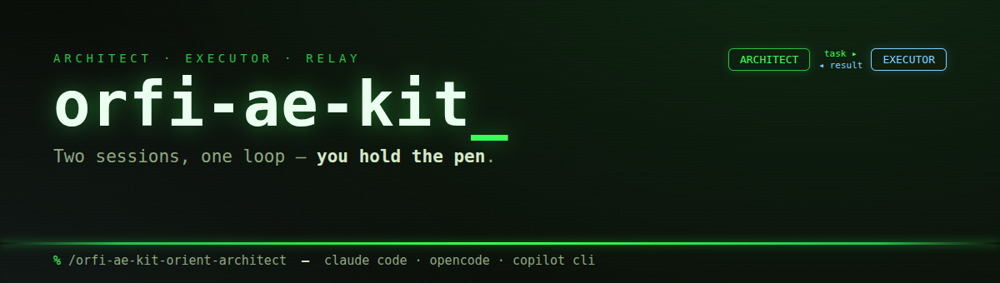

# orfi-ae-kit

**Two sessions, one loop — you hold the pen.**

**orfi-ae-kit** packages the **Architect/Executor** two-session AI development pattern as a set of slash-command skills. It is the **optional companion** to the generic [orfi-kit](#prerequisite--orfi-kit). The pattern was originally explored as a standalone desktop app codenamed *SonOfAnton* — that app was **shelved**. orfi-ae-kit is **skills-only: there is no app**, no daemon, no background process. Everything is commands you invoke inside your AI CLI.

## Prerequisite — orfi-kit

**Install [orfi-kit](https://github.com/) first.** orfi-ae-kit is a separate add-on, **not merged** with orfi-kit. The dependency is soft — the AE commands are nearly standalone — but the Architect/Executor workflow leans on orfi-kit's generic git / test / guardrail skills to get work done. The installer only **warns** if orfi-kit is missing (it never blocks); this README is where the requirement is documented.

## The Architect/Executor pattern

You run **two context-isolated AI sessions** against one piece of work:

- The **Executor** session implements — it writes code, runs tests, does the hands-on work.
- The **Architect** session directs and verifies — it decides what to build next, writes the task brief, and critically reviews what the Executor reports back. The Architect also acts as an **interactive thinking-partner / sidekick** to the human: helping draft the prompts that go to the Executor and helping decode the Executor's questions and results.

The two sessions never share a context window. They communicate **only through file-based relay files** on disk. A **human sits at the decision points** — approving tasks, resolving blockers, and steering the loop.

## The relay loop

```
orient (Architect)
  → relay-to-executor (Architect writes task)
    → relay-read-task (Executor reads task)
      → Executor does the work
        → relay-to-architect (Executor writes result)
          → relay-read-result (Architect reviews critically)
            → repeat (Architect relays the next task)
```

## Command reference

| Command | Role |
| --- | --- |
| `/orfi-ae-kit-orient-architect` | Orient this session as the Architect (reads orientation + session-state + onboarding). |
| `/orfi-ae-kit-relay-to-executor` | Architect: write the next task to the executor relay file. |
| `/orfi-ae-kit-relay-read-task` | Executor: read the task the Architect left. |
| `/orfi-ae-kit-relay-to-architect` | Executor: write your result/report back. |
| `/orfi-ae-kit-relay-read-result` | Architect: read and critically review the Executor's result. |

In Claude Code these are **commands**; in GitHub Copilot CLI the equivalent **skills** are their own slash commands. Full parity: 5 Claude commands mirrored as 5 Copilot skills.

## Install

Two equivalent installers — use whichever matches your shell.

```bash
# bash (Linux / macOS / WSL)
./install.sh
```

```powershell
# PowerShell (Windows PowerShell 5+, or pwsh anywhere)
./install.ps1
```

Each launches an interactive runtime menu:

```
Install for which runtime(s)?
  1) Claude Code
  2) OpenCode
  3) GitHub Copilot CLI
Select one or more (e.g. '1', '3', or '1 2 3' / '1,2' for several).
```

Selections may be **space- or comma-separated** (`1`, `1 2`, `1,3`, `1 2 3`).

### Flags

| bash | PowerShell | Meaning |
| --- | --- | --- |
| `--link` | `-Link` | symlink instead of copy (dev mode: repo edits go live) |
| `--uninstall` | `-Uninstall` | remove an existing orfi-ae-kit install |
| `--help` / `-h` | `-Help` | print usage |

### Install destinations

| Runtime | Source | Destination |
| --- | --- | --- |
| Claude Code | `claude/commands/*.md` | `~/.claude/commands/` |
| OpenCode | `claude/commands/*.md` | `~/.config/opencode/commands/` (honours `$XDG_CONFIG_HOME`) |
| GitHub Copilot CLI | `copilot/skills/<dir>/` | `~/.copilot/skills/` |

Claude and OpenCode share the same **command** source; each gets its own copy in its own commands dir. Copilot's **skills** come from a different source dir and install to their own home.

## Uninstall

```bash
./install.sh --uninstall
```

```powershell
./install.ps1 -Uninstall
```

Removes the 5 commands from the Claude/OpenCode commands dirs and the 5 skill dirs from `~/.copilot/skills`, for whichever runtimes you select.

## Known environment assumption — hard-coded relay paths

The command/skill bodies reference one user's **real Windows relay setup** with absolute paths. These appear literally inside the files and are preserved as-is:

```
C:\repos\helper_files\relay\relay-to-executor.md     (task: Architect → Executor)
C:\repos\helper_files\relay\relay-to-architect.md    (result: Executor → Architect)
C:\repos\helper_files\architect-orientation.md       (who the Architect is / how it operates)
C:\repos\helper_files\CLAUDE-SESSION-STATE.md         (shared handoff state)
C:\repos\helper_files\ONBOARDING.md                   (epic single source of truth, read if it exists)
```

These paths are environment-specific (one user's Windows machine).

> **TODO (known limitation):** make the relay root configurable (e.g. an env var / config value) rather than hard-coding it to `C:\repos\helper_files`. Documented here as a known limitation, not yet implemented.

## License

MIT — see [LICENSE](LICENSE).
